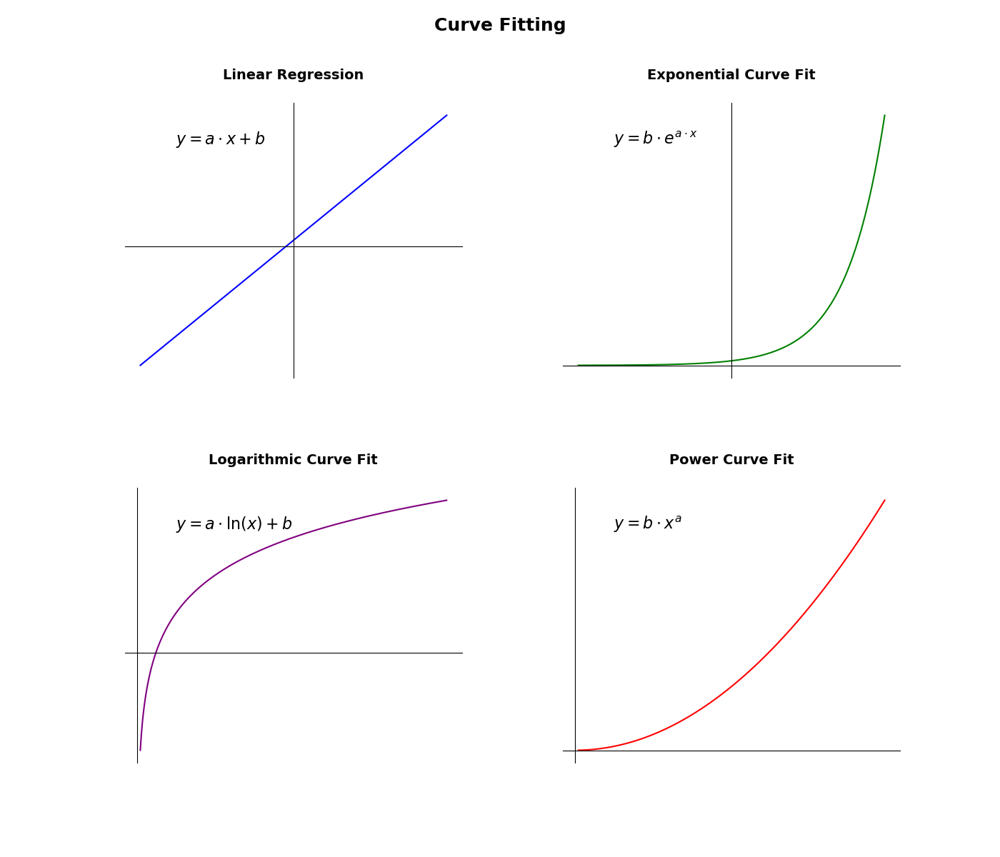

# Curve Fitting

## Summary

Lightweight curve fitting for linear, exponential, logarithmic, and power regressions. Designed for minimal RAM usage and efficient use on microcontrollers (Arduino).
The library provides four classes:

| class  | equation      | description               |
| ------ | ------------- | ------------------------- |
| linFit | $y=a.x+b$     | linear regression         |
| expFit | $y=b.e^{a.x}$ | exponential curve fitting |
| logFit | $y=a.ln(x)+b$ | logarithmic curve fitting |
| powFit | $y=b.x^a$     | power curve fitting       |

## Methods

Each class offers the following methods:

| method      | description                                                                                                                                                          |
| ----------- | -------------------------------------------------------------------------------------------------------------------------------------------------------------------- |
| clear()     | Clears all stored statistics.                                                                                                                                        |
| add(x,y)    | Adds a new (x, y) data point.                                                                                                                                        |
| remove(x,y) | Removes a previously added (x, y) data point.                                                                                                                        |
| n()         | Returns the number of samples.                                                                                                                                       |
| a()         | Returns the number $a$ from the equations above. In linear regression, $a$ is the slope of the fitted line.                                                          |
| b()         | Returns the number $b$ from the equations above. In linear regression, $b$ is the intercept of the fitted line.                                                      |
| r()         | Returns the correlation coefficient.                                                                                                                                 |
| sd_x()      | In linear and exponential curve fitting, returns the standard deviation of x. In logarithmic and power curve fitting, returns the geometric standard deviation of x. |
| sd_y()      | In linear and logarithmic curve fitting, returns the standard deviation of y. In exponential and power curve fitting, returns the geometric standard deviation of y. |
| mean_x()    | In linear and exponential curve fitting, returns the mean of x. In logarithmic and power curve fitting, returns the geometric mean of x.                             |
| mean_y()    | In linear and logarithmic curve fitting, returns the mean of y. In exponential and power curve fitting, returns the geometric mean of y.                             |
| y(x)        | Computes y for a given x.                                                                                                                                            |
| x(y)        | Computes x for a given y.                                                                                                                                            |

## Examples

- [led](examples/led/README.md) modeling the diminishing brightness of a LED lamp.
- [light sensor](https://github.com/koendv/xyc-als21c-k1/tree/main/examples/als21c_compare) validating a new light sensor by correlating with a known good sensor.

## Notes

The four curve fitting methods are related:

| class  | x       | y       | note       |
| ------ | ------- | ------- | ---------- |
| linFit | $x$     | $y$     |            |
| expFit | $x$     | $ln(y)$ | $y>0$      |
| logFit | $ln(x)$ | $y$     | $x>0$      |
| powFit | $ln(x)$ | $ln(y)$ | $x>0, y>0$ |

As an example, take exponential curve fitting. Exponential curve fitting of $(x,y)$ is implemented as linear regression of $(x, ln(y))$. This requires $y>0$. Substituting $y$ with the logarithm of $y$, the mean of $y$ becomes the *geometric mean* of $y$, and the standard deviation of $y$ becomes the *geometric standard deviation* of $y$.

Negative and zero values of x will cause NaN (not a number) errors in logarithmic and power curve fits. Negative and zero values of y will cause NaN errors in exponential and power curve fits.

Default is single precision floating point, 24 bytes of RAM used per regression. Bytes of RAM used is independent of the number of data points.

For double precision specify the type, e.g. `linFit<double>`
