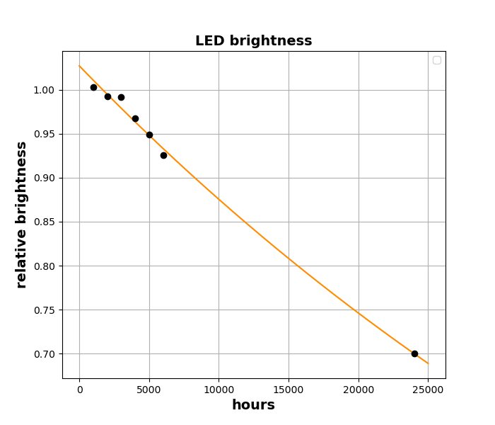

## Example: led lifetime

## Problem

The brightness of a LED lamp is measured every 1000 hours. In the following experimental data a brightness of 1.0 represents the brightness of a brand-new led.

| hours | brightness |
| ----- | ---------- |
| 1000  | 1.0032     |
| 2000  | 0.9924     |
| 3000  | 0.9919     |
| 4000  | 0.9677     |
| 5000  | 0.9493     |
| 6000  | 0.9258     |

Model the brightness as exponential decay:\
$$brightness = b.e^{a.hours}$$\
How many hours until the LED is at 70% of the initial brightness?

## Code

[led.ino](led.ino)

## Output



```
brightness = 1.0272 * exp(- hours / 62571.0507)
correlation = -0.9663
70% brightness after 23997.47 hours
```

The time constant of the exponential decay is 62500 hours, about 7 years.
The correlation is negative, as LED brightness decreases with time.
The LED is at 70% brightness after 24000 hours, or 1000 days.
